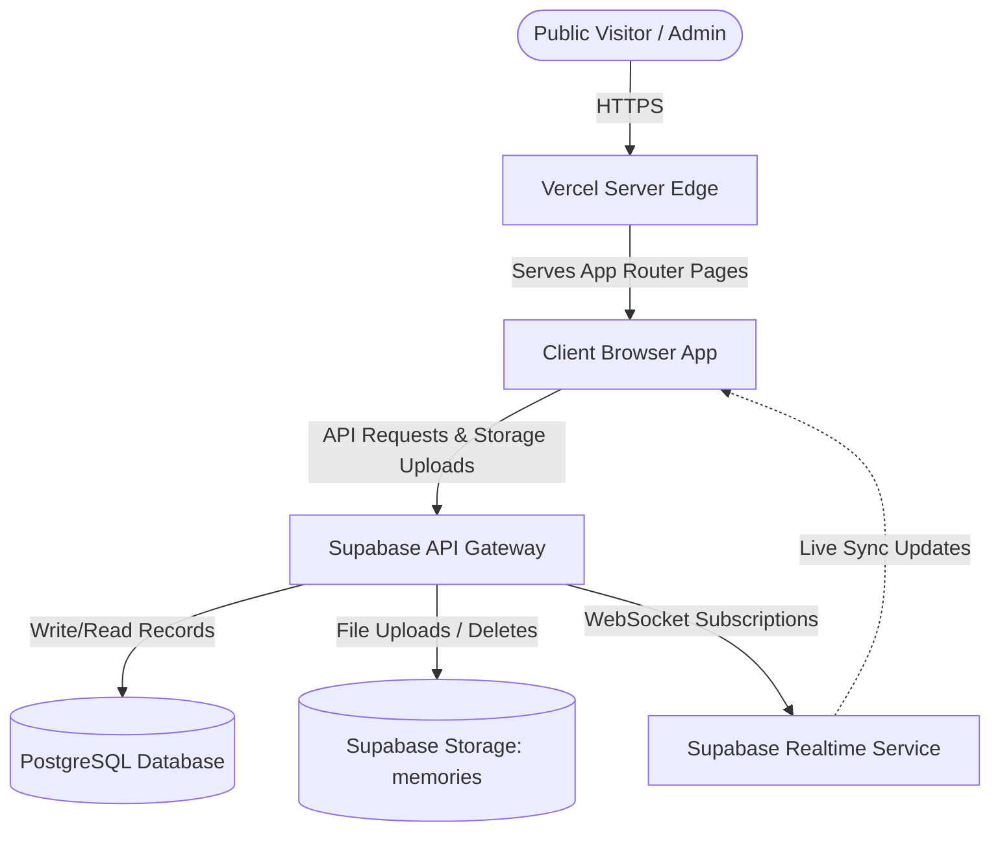
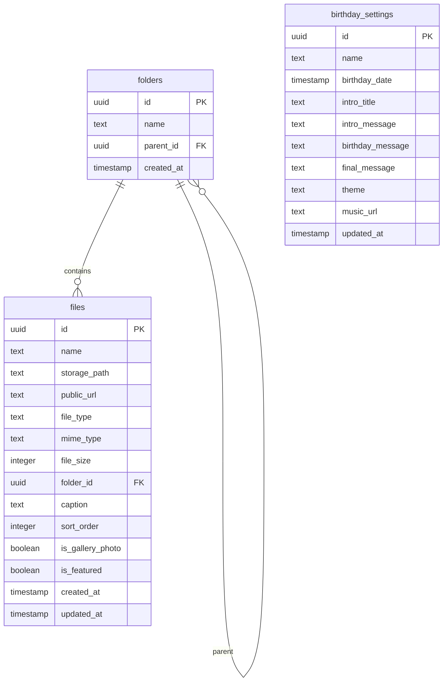

# System Architecture: Khaaviya's Birthday Surprise App

This document outlines the full-stack, cloud-connected architecture of Khaaviya's Birthday Surprise Website. It functions as a complete technical guide for the frontend, cloud databases, file storage systems, and real-time syncing layers.

---

## 1. Overview
The application is structured as a **Server-Side Rendered (SSR) & Client-Interactive Next.js App Router Application** integrated with **Supabase Backend-as-a-Service (BaaS)**.



---

## 2. Frontend Technology
* **Framework**: Next.js App Router (React.js)
* **Styling**: Vanilla CSS (migrated globally into `app/globals.css` to protect luxury burgundy layouts and custom keyframe animations).
* **Iconography**: FontAwesome icons (loaded via RootLayout link CDN).
* **Asset Media Rendering**: HTML5 Canvas (fireworks particles), CSS keyframes (floating hearts/balloons), and HTML5 audio engines.

---

## 3. Backend & Database (Supabase)
The database layer uses PostgreSQL managed by Supabase.

### Entity-Relationship Diagram (Database Schema)



---

## 4. Supabase Storage Bucket
* **Bucket ID**: `memories`
* **Visibility**: Public read-only (`public: true`).
* **Folder Structure**: Dynamically generated UUID paths to avoid naming collisions.
* **Supported Extensions**:
  * **Images**: JPG, JPEG, PNG, WEBP, HEIC
  * **Videos**: MP4, MOV, WEBM
  * **Documents**: PDF

---

## 5. Security & Authentication
* **Service-Role Safety**: Service-role private keys are never exposed to the client. Only the anonymous public client key is used in frontend code.
* **Row Level Security (RLS)**:
  * Anonymous users can query (`SELECT`) `folders`, `files`, and `birthday_settings` so public birthday cards function out of the box.
  * Anonymous users cannot insert, update, or delete.
  * Administrators must authenticate via **Supabase Auth** to acquire JWT claims matching the `authenticated` role to execute modify queries.
* **Admin Login Redirection Bridge**:
  * Form inputs for credentials username (`kaaviya`) and password (`26/12`) are mapped under-the-hood to the Supabase authenticated account `kaaviya@birthday.com` (with password `kaaviya_26_12`) to comply with backend length regulations seamlessly.
  * The first login automatically registers/provisions this administrator profile on the database.

---

## 6. Realtime Syncing Engine
Both client landing portals establish WebSocket channels to Supabase:
* **Settings Channel**: Monitors changes to the `birthday_settings` table. Live modifications automatically trigger layout theme switches, custom countdown updates, and text adjustments on active terminals without reloading.
* **Files Channel**: Monitors additions/deletions on the `files` table. Modifying slideshow photo settings in the Memories page updates slides instantly on running devices.

---

## 7. Environment Variables (`.env.local`)
Create a `.env.local` file at the root containing these keys to interface with your Supabase server:

```env
NEXT_PUBLIC_SUPABASE_URL=https://your-project-id.supabase.co
NEXT_PUBLIC_SUPABASE_ANON_KEY=your-supabase-anonymous-anon-key-here
```

---

## 8. Deployment & Hosting
* **Edge Hosting**: Vercel targets the main branch of your GitHub repository.
* **Deployment Steps**:
  1. Set up a free Supabase project and execute `schema.sql` queries.
  2. Deploy Next.js onto Vercel.
  3. Input `.env.local` environment variables inside the Vercel Dashboard Settings -> Environment Variables.
  4. Build & deploy.
